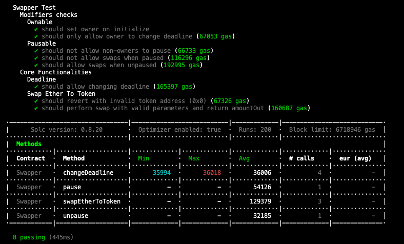

# Swapping ERC20 Tokens

This project is a smart contract that allows you to swap ERC20 tokens using Uniswap V3.

## Prerequisites

Before you begin, ensure you have met the following requirements:

- You have installed the latest version of [Node.js and npm](https://nodejs.org/en/download/).
- You have a Windows/Linux/Mac machine.
- You have read the [Uniswap V3 documentation](https://docs.uniswap.org/).

## Installing Swapping ERC20 Tokens

To install the Swapping ERC20 Tokens, follow these steps:

1. Clone the repository:
    ```bash
    git clone https://github.com/yourusername/swapping-ERC20.git
    ```

2. Navigate to the project directory:
    ```bash
    cd swapping-ERC20
    ```

3. Install the dependencies:
    ```bash
    npm install
    ```

## Using Swapping ERC20 Tokens

To use the Swapping ERC20 Tokens, follow these steps:

### Configuring the Environment Variables

Before running the project, you need to configure the environment variables. These variables are used to specify the settings for the Ethereum network and the smart contracts.

Create a `.env` file in the root directory of the project and add the following variables:

```properties
ROUTER_ADDRESS = "<UniswapV3_Router_Address>" --> "0xE592427A0AEce92De3Edee1F18E0157C05861564"
QUOTER_ADDRESS = "<UniswapV3_Quoter_Address>" --> "0xb27308f9F90D607463bb33eA1BeBb41C27CE5AB6"
WETH_ADDRESS = "<WETH_Address>" --> "0xC02aaA39b223FE8D0A0e5C4F27eAD9083C756Cc2"

RPC_URL_ARBITRUM = "<Your_Arbitrum_RPC_URL>"
PRIVATE_KEY = "<Your_Private_Key>"
```

- `RPC_URL_ARBITRUM`: This is the RPC URL for the Arbitrum network. You can get this URL from [Alchemy](https://www.alchemy.com/) or [Infura](https://infura.io/).
- `PRIVATE_KEY`: This is the private key of your Ethereum account. **Be careful not to share this key with anyone.**
- `ROUTER_ADDRESS`: This is the address of the Uniswap V3 Router contract. You can find this address in the [Uniswap V3 documentation](https://docs.uniswap.org/contracts/v3/reference/deployments).
- `QUOTER_ADDRESS`: This is the address of the Uniswap V3 Quoter contract. You can find this address in the [Uniswap V3 documentation](https://docs.uniswap.org/contracts/v3/reference/deployments).
- `WETH_ADDRESS`: This is the address of the WETH contract. You can find this address in the [Uniswap V3 documentation](https://docs.uniswap.org/contracts/v3/reference/deployments).

Replace `<Your_Arbitrum_RPC_URL>`, `<Your_Private_Key>`, `<UniswapV3_Router_Address>`, `<UniswapV3_Quoter_Address>`, and `<WETH_Address>` with your actual values.


### 2. Compile the contracts

First, you need to compile the smart contracts. This will check the contracts for errors and prepare them for deployment.

```bash
npx hardhat compile
```

### 3. Run a Local Ethereum Node

Before deploying the contracts, you need to run a local Ethereum node. We will use Hardhat Network for this, which is a local Ethereum network designed for development.

We will also fork the Ethereum mainnet. This allows us to simulate the state of the mainnet for testing purposes, which is useful for interacting with real smart contracts and replicating live scenarios.

Run the following command to start a local Ethereum node and fork the mainnet:

```bash
npx hardhat node --fork https://eth-mainnet.g.alchemy.com/v2/<YOUR_ETHEREUM_MAINNET_APIKEY> --no-deploy
```

### 4. Deploy the Contracts

Now you can deploy the contracts to your local Ethereum network. We use the --network localhost option to specify that we want to deploy to our local Ethereum node.

We also use the --tags Swapper option to only deploy the contracts tagged with "Swapper".

Run the following command to deploy the contracts:

```bash
npx hardhat deploy --network localhost --tags Swapper
```

### 5. Test the Contracts

After deploying the contracts, you can run tests against them. We use the --network localhost option to specify that we want to run the tests on our local Ethereum node.

Run the following command to test the contracts:

```bash
npx hardhat test --network localhost test/01_swapperTest.ts
```



### 6. Interact with the Contracts

Finally, you can interact with the deployed contracts using Hardhat tasks or a web3 library like ethers.js. This allows you to call functions on the contracts and read their state.

## Contributing to Swapping ERC20 Tokens

To contribute to Swapping ERC20 Tokens, follow these steps:

1. Fork this repository.
2. Create a branch: `git checkout -b <branch_name>`.
3. Make your changes and commit them: `git commit -m '<commit_message>'`
4. Push to the original branch: `git push origin <project_name>/<location>`
5. Create the pull request.

## License

This project uses the following license: [MIT](<link_to_license>).